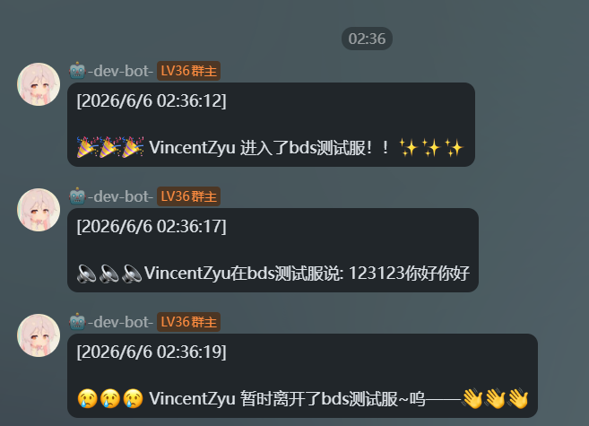
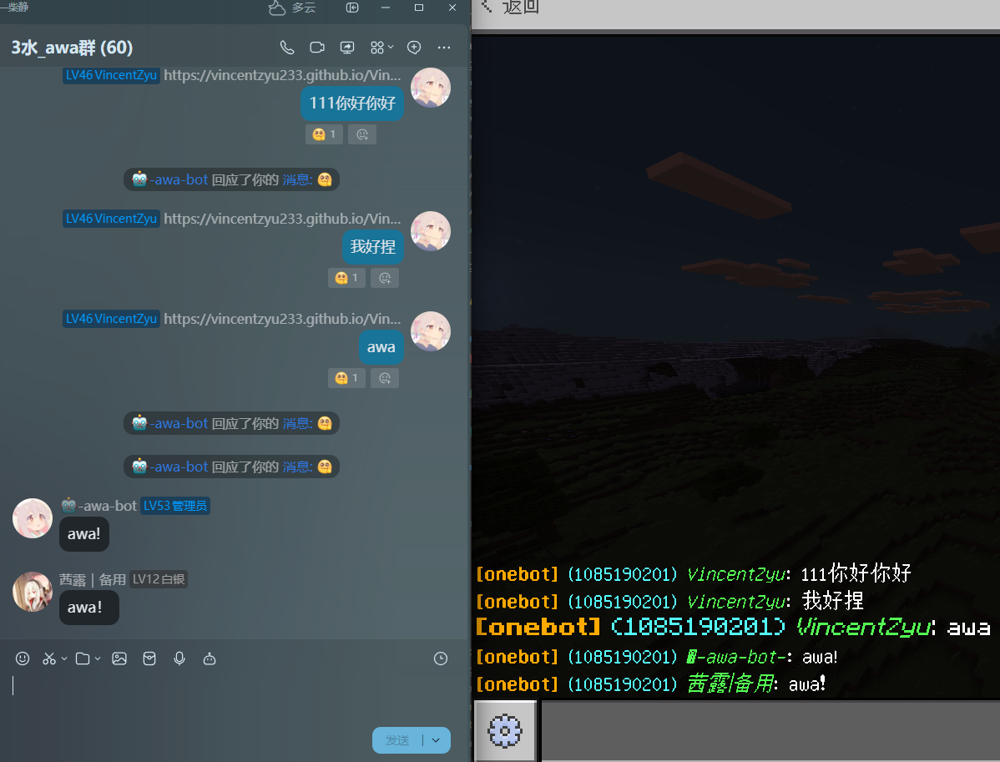
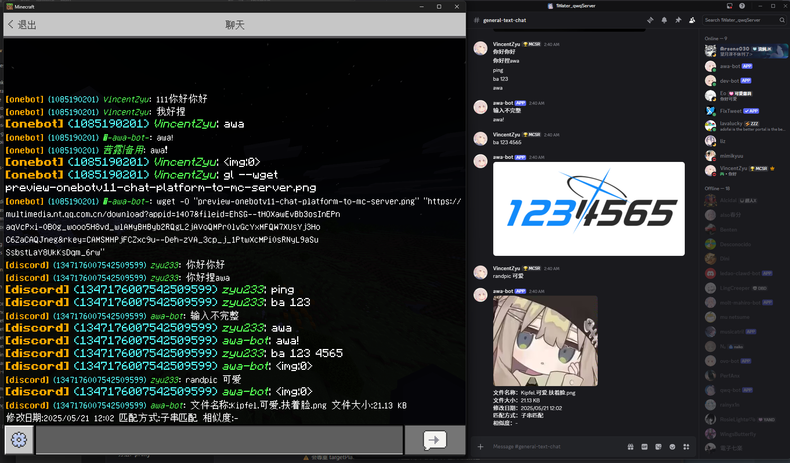
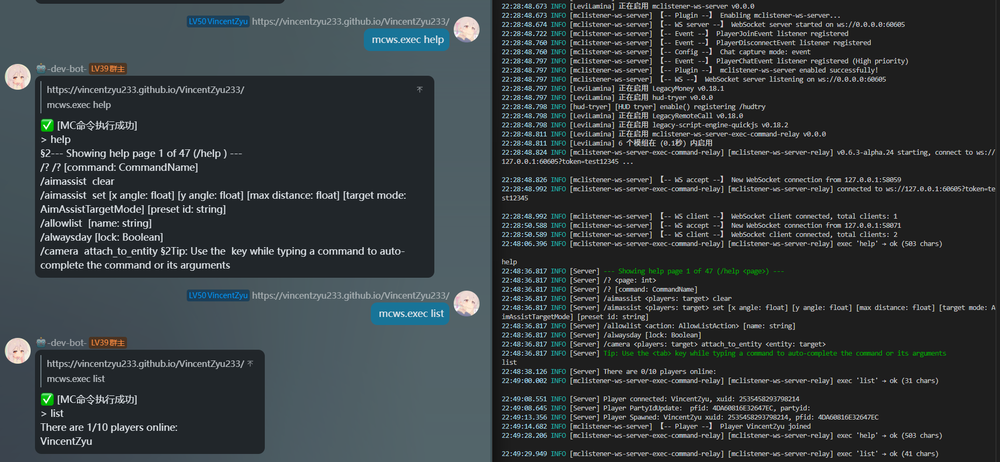

> **[📖 部署运维手册 (docs/prod.md)](docs/prod.md)**
> **[📖 开发编译指南 (docs/dev.md)](docs/dev.md)**


# levilamina-plugin-mclistener-ws-server

> 🌐 基岩版 Minecraft 服务端 Levilamina 群服互通 WebSocket 插件：对接 Koishi 客户端，实现双向消息转发、玩家进出通知。  

> 🌐 A WebSocket server plugin for LeviLamina to bridge Minecraft Bedrock Server with chat platforms via Koishi.

[](https://github.com/VincentZyuApps/levilamina-plugin-mclistener-ws-server)
[](https://gitee.com/vincent-zyu/levilamina-plugin-mclistener-ws-server)

[](https://github.com/LiteLDev/LeviLamina)
[![Minecraft Bedrock Edition](https://img.shields.io/badge/for-Minecraft_Bedrock_Edition-2A5E38?style=for-the-badge&logo=data%3Aimage%2Fsvg%2Bxml%3Bbase64%2CPHN2ZyBmaWxsPSJ3aGl0ZSIgeG1sbnM9Imh0dHA6Ly93d3cudzMub3JnLzIwMDAvc3ZnIiB2aWV3Qm94PSIwIDAgMTYgMTYiPjxyZWN0IHg9IjAiIHk9IjAiIHdpZHRoPSIxNiIgaGVpZ2h0PSIxNiIgZmlsbD0iIzZCNEUyRSIvPjxyZWN0IHg9IjAiIHk9IjAiIHdpZHRoPSIxNiIgaGVpZ2h0PSI2IiBmaWxsPSIjM0Q3QTJFIi8%2BPHJlY3QgeD0iMCIgeT0iMCIgd2lkdGg9IjQiIGhlaWdodD0iNCIgZmlsbD0iIzVCOUEzRSIvPjxyZWN0IHg9IjgiIHk9IjAiIHdpZHRoPSI0IiBoZWlnaHQ9IjQiIGZpbGw9IiM1QjlBM0UiLz48cmVjdCB4PSI0IiB5PSI0IiB3aWR0aD0iNCIgaGVpZ2h0PSIyIiBmaWxsPSIjNUI5QTNFIi8%2BPHJlY3QgeD0iMTIiIHk9IjQiIHdpZHRoPSI0IiBoZWlnaHQ9IjIiIGZpbGw9IiM1QjlBM0UiLz48cmVjdCB4PSIyIiB5PSI4IiB3aWR0aD0iMiIgaGVpZ2h0PSIyIiBmaWxsPSIjOEI2QjRFIi8%2BPHJlY3QgeD0iNiIgeT0iOCIgd2lkdGg9IjQiIGhlaWdodD0iNCIgZmlsbD0iIzhCNkI0RSIvPjxyZWN0IHg9IjEyIiB5PSI2IiB3aWR0aD0iMiIgaGVpZ2h0PSI0IiBmaWxsPSIjOEI2QjRFIi8%2BPHJlY3QgeD0iMCIgeT0iMTIiIHdpZHRoPSI2IiBoZWlnaHQ9IjQiIGZpbGw9IiM4QjZCNEUiLz48cmVjdCB4PSIxMCIgeT0iMTAiIHdpZHRoPSI2IiBoZWlnaHQ9IjYiIGZpbGw9IiM4QjZCNEUiLz48L3N2Zz4%3D&labelColor=6B4E2E)](https://apps.microsoft.com/detail/9nqgktxr9bzf?hl=zh-CN)

[](https://xmake.io)
[](https://en.cppreference.com/w/cpp/20)
[](https://learn.microsoft.com/en-us/cpp/)
[](https://github.com/VincentZyuApps/levilamina-plugin-mclistener-ws-server/commits/main)
[](https://github.com/VincentZyuApps/levilamina-plugin-mclistener-ws-server/actions)

[](https://github.com/VincentZyuApps/levilamina-plugin-mclistener-ws-server/releases)

[](https://qm.qq.com/q/4vjto4V7Di)

<p><del>💬 插件使用问题 / 🐛 Bug反馈 / 👨‍💻 插件开发交流，欢迎加入QQ群：<b>259248174</b>   🎉（这个群G了</del> </p>
<p>💬 插件使用问题 / 🐛 Bug反馈 / 👨‍💻 插件开发交流，欢迎加入QQ群：<b>1085190201</b> 🎉</p>
<p>💡 在群里直接艾特我，回复的更快哦~ ✨</p>

---

## 🚀 3 分钟快速上手

### Step 1: 安装服务端插件

```bash
lip install github.com/VincentZyuApps/levilamina-plugin-mclistener-ws-server@0.6.5-alpha.28
# 如果你的环境里 lip 解析 latest-version 正常，也可以尝试：
lip install github.com/VincentZyuApps/levilamina-plugin-mclistener-ws-server
# 如果是已经安装，想要更新
lip update github.com/__REPO__@__VERSION__
```

或手动下载 Release 解压到 `plugins/` 目录后重启服务端。

### Step 2:（可选）安装 exec-relay.js 实现远程指令执行

> 跳过此步也不影响基础群服互通功能

```bash
# 安装 LegacyScriptEngine QuickJS 引擎
lip install github.com/LiteLDev/LegacyScriptEngine#quickjs
# 将 js/exec-relay.js 放入 plugins/ 目录，编辑顶部 RELAY_PORT / RELAY_TOKEN 与 config.json 一致
# 在 config.json 中设置
#    "execCommandMode": "js-relay"
# 重启服务器两次（LSE 第一次迁移文件，第二次加载）
```

### Step 3: 配置 Koishi 客户端

在 Koishi 端安装 [`koishi-plugin-mclistener-ws-client`](https://github.com/VincentZyuApps/koishi-plugin-mclistener-ws-client)，配置：

- `wsServerUrl`: `ws://你的服务器IP:60201`
- `wsToken`: 与服务端 `ws_token` 一致（如不校验可不填）
- `sourcePlatformList` / `targetPlatformChannelList`: 你的群/频道

### Step 4: 验证互通

- 🎮 游戏里说话 → 群里应收到玩家聊天消息
- 💬 群里发消息 → 游戏内应显示 `[群名] (群号) 昵称: 消息`
- 🖥️（可选）`mcws.exec list` → 返回在线玩家列表

---

## 📡 互通架构

### 聊天平台一侧

聊天平台 **消息** ⇄ 基岩版 Minecraft 服务器 **文字消息与进出服事件** 的群服互通插件。

支持 Koishi Bot 接入，理论上 Koishi 支持的大部分聊天平台均可使用。

> 已有现成的 Koishi 插件: [](https://github.com/VincentZyuApps/koishi-plugin-mclistener-ws-client)[`koishi-plugin-mclistener-ws-client`](https://github.com/VincentZyuApps/koishi-plugin-mclistener-ws-client)

- **QQ 接入（OneBot v11）**：Koishi 通过 `@koishijs/plugin-adapter-onebot` 适配器，对接 OneBot v11 协议实现端（如 LLOneBot、NapCat、Lagrange.OneBot 等）
- **Discord 接入**：Koishi 通过 `@koishijs/plugin-adapter-discord` 适配器，直连 Discord Gateway API
- **更多平台**：Kook、Telegram 等 Koishi 支持的平台均可

> 当然你也可以自己编写插件把他接入到其他的Bot框架，比如[Koishi](https://koishi.chat/zh-CN/manual/starter/boilerplate.html)，[Nonebot2](https://nonebot.dev/docs/quick-start)，[Astrbot](https://docs.astrbot.app/deploy/astrbot/docker.html)等等，或者其他任何形式的Web应用的 [WebSocket](https://github.com/websockets/ws)客户端接入。

### 基岩版服务器一侧

支持 LeviLamina 26.10.x 的 Minecraft 基岩版专用服务器 (BDS)。

> 如果你运行的是 **Minecraft Java版 服务端，并使用MCDReforged托管**，请使用 [](https://mcdreforged.com/zh-CN) [mcdr_listener_ws_server](https://github.com/VincentZyuApps/mcdr_listener_ws_server)（与本插件使用同一 WebSocket 协议，可共用 Koishi 客户端）。

---

## ✨ 功能特性

### 🌐 WebSocket 服务器

- 作为 WebSocket 服务端接受客户端连接
- 广播玩家进出服事件至所有已连接的客户端
- 接收聊天平台消息并在游戏内广播

### 🎮 玩家进出通知

- 玩家加入服务器时自动广播（可配置开关）
- 玩家离开服务器时自动广播（可配置开关）

### ⚙️ MC服务端灵活的消息捕获方式

| 模式 | 说明 | 适用场景 |
|------|------|----------|
| `event` | 使用 LeviLamina PlayerChatEvent（默认） | 与其他插件兼容性最好 |
| `hook_packet` | 直接 Hook TextPacket 处理函数 | 被 GwChat 等插件拦截事件时使用 |
| `both` | 同时使用两种方式 | 调试用，可能导致重复消息 |

### 💬 聊天消息双向转发

**MC 服务器 → 聊天平台**
- 玩家聊天消息自动广播到 WebSocket 客户端
##### **QQ（OneBot v11）**: 

**聊天平台 → MC 服务器**
- 群聊消息转发到游戏内，支持自定义消息格式
##### **QQ（OneBot v11）**: 
##### **Discord**: 

### 🔧 远程指令执行（js-relay）

通过 LSE JS 伴侣插件 `exec-relay.js`，聊天平台可向服务器发送 Minecraft 指令并获取执行结果：

##### **QQ（OneBot v11）**: 

> 需要同时开启 Koishi 侧 `enableExecCommand` 和服务端 `execCommandMode: "js-relay"`

---

## 📦 安装

### 前置要求

- LeviLamina 26.10.x
- Minecraft 基岩版专用服务器 (BDS)

### 使用 lip 安装（推荐）

```bash
lip install github.com/VincentZyuApps/levilamina-plugin-mclistener-ws-server@<版本号>
# 比如：
lip install github.com/VincentZyuApps/levilamina-plugin-mclistener-ws-server@0.6.5-alpha.28
# 如果你的环境里 latest-version 解析正常，也可以尝试让lip直接解析最新的版本号
lip install github.com/VincentZyuApps/levilamina-plugin-mclistener-ws-server
```

### 手动安装

- **1.下载**
从 [GitHub Releases](https://github.com/VincentZyuApps/levilamina-plugin-mclistener-ws-server/releases) 下载 `mclistener-ws-server-server-windows-x64.zip`

- **2.解压**
解压，得到目录：
   ```
   mclistener-ws-server/
   ├── manifest.json
   ├── mclistener-ws-server.dll
   └── mclistener-ws-server.pdb
   ```

- **3.复制，并验证目录结构**
将 `mclistener-ws-server/` 文件夹复制到服务端 `plugins/` 下
   （文件夹名保持 **`mclistener-ws-server`**）：
   ```
   BDS服务端/
   ├── bedrock_server_mod.exe
   ├── PreLoader.dll
   ├── plugins/
   │   ├── LeviLamina/                  ← BDS 模组加载器（预装）
   │   │   ├── LeviLamina.dll
   │   │   └── ...
   │   └── mclistener-ws-server/        ← 把文件夹复制放入这里 
   │       ├── manifest.json
   │       ├── mclistener-ws-server.dll
   │       ├── mclistener-ws-server.pdb
   │       └── config/                  ← 后续插件第一次加载会自动生成的 
   │           └── config.json
   └── ...
   ```

- **4. 重启服务端**
`config/config.json` 会在首次启动时自动生成在插件目录下 ↑

#### 安装 exec-relay.js（可选，远程指令执行）

> 需要 [LegacyScriptEngine](https://github.com/LiteLDev/LegacyScriptEngine) QuickJS 引擎

- **(1). 安装 LSE QuickJS 引擎**
    ```bash
    lip install github.com/LiteLDev/LegacyScriptEngine#quickjs
    ```

- **(2). 放入js插件文件**
    将 `exec-relay.js` 放入 `plugins/` 目录从 [Releases](https://github.com/VincentZyuApps/levilamina-plugin-mclistener-ws-server/releases) 下载，或直接从 [`js/exec-relay.js`](js/exec-relay.js) 复制。

- **(3). 编辑js文件内配置**
    编辑js文件顶部的 `RELAY_PORT` / `RELAY_TOKEN`变量，使其与 C++ 插件 `config.json` 保持一致

- **(4). 在 `config.json` 中启用**：
    ```json
    "execCommandMode": "js-relay"
    ```

- **(5). 重启服务器两次**
    （LSE 第一次启动会迁移文件，第二次正式加载）
    这是第一次重启的日志:
    ```powershell
    03:56:26.281 INFO [LeviLamina] 正在加载 legacy-script-engine-quickjs v0.18.2
    03:56:27.019 INFO [legacy-script-engine-quickjs] 正在迁移旧版插件...
    03:56:27.019 INFO [legacy-script-engine-quickjs] 正在迁移位于 ./plugins/exec-relay.js 的旧版插件
    03:56:27.020 WARN [legacy-script-engine-quickjs] 旧版插件已迁移，请重启服务器以加载它们！
    ```


---

## ⚙️ 配置

首次启动后自动生成配置文件 `plugins/mclistener-ws-server/config/config.json`：

```json
{
    "version": 1,
    "logLevel": "info",
    "host": "0.0.0.0",
    "port": 60605,
    "wsToken": "test12345",
    "wsTokenMode": "any",
    "wsTokenAuthTimeoutMs": 5555,
    "enablePlayerJoinBroadcast": true,
    "enablePlayerLeaveBroadcast": true,
    "enablePlayerChatBroadcast": true,
    "enableReceiveGroupMessage": true,
    "chatCaptureMode": "event",
    "groupMessageFormat": "§6§l[{group_name}]§r §b({group_id})§r §a§o{nickname}§r§f: {message}",
    "execCommandMode": "disabled"
}
```

| 配置项 | 类型 | 默认值 | 说明 |
|--------|------|--------|------|
| `version` | int | `1` | 配置文件版本，请勿修改 |
| `logLevel` | string | `"info"` | 日志级别：`silent` \| `fatal` \| `error` \| `warn` \| `info` \| `debug` \| `trace` |
| `host` | string | `"0.0.0.0"` | WebSocket 监听地址 |
| `port` | int | `60605` | WebSocket 监听端口 |
| `wsToken` | string | `"test12345"` | WebSocket 连接 Token（空字符串表示不校验） |
| `wsTokenMode` | string | `"any"` | Token 校验模式：`any`(URL或消息均可) \| `param`(仅URL参数) \| `message`(仅auth消息) \| `disabled`(关闭校验) |
| `wsTokenAuthTimeoutMs` | int | `5555` | post-connection auth 消息鉴权超时（毫秒） |
| `enablePlayerJoinBroadcast` | bool | `true` | 广播玩家加入事件 |
| `enablePlayerLeaveBroadcast` | bool | `true` | 广播玩家离开事件 |
| `enablePlayerChatBroadcast` | bool | `true` | 广播玩家聊天事件 |
| `enableReceiveGroupMessage` | bool | `true` | 接收群消息并转发到游戏内 |
| `chatCaptureMode` | string | `"event"` | 聊天捕获方式：见下方「消息捕获模式」 |
| `groupMessageFormat` | string | *见下方* | 群消息在游戏内的显示格式 |
| `execCommandMode` | string | `"disabled"` | 远程指令执行模式：`disabled`(关闭) \| `js-relay`(JS中继) \| `cpp-native`(C++直接执行) \| `both`(双路径并行,容错) |

### 💬 消息捕获模式（chatCaptureMode）

| 模式 | 说明 | 适用场景 |
|------|------|----------|
| `event` | 使用 LeviLamina `PlayerChatEvent`（默认） | 与其他插件兼容性最好 |
| `hook_packet` | 直接 Hook `TextPacket` 处理函数 | 被 GwChat 等插件拦截事件时使用 |
| `both` | 同时使用两种方式 | 调试用，可能导致重复消息 |

> 详细配置说明见 [`docs/prod.md`](docs/prod.md)

---

## 📡 WebSocket 协议

### 服务端 → 客户端（广播）

**玩家加入**
```json
{"type": "player_join", "player_name": "Steve"}
```

**玩家离开**
```json
{"type": "player_leave", "player_name": "Steve"}
```

**玩家聊天**
```json
{"type": "player_chat", "player_name": "Steve", "content": "Hello!"}
```

### 客户端 → 服务端

**群聊消息转发**
```json
{
    "type": "chat_platform_to_server",
    "group_id": "1085190201",
    "group_name": "onebot",
    "nickname": "Alice",
    "message": "大家好"
}
```

**远程指令执行请求**（需 `execCommandMode: "js-relay"`）
```json
{"type": "execute_command", "request_id": "abc123", "command": "list"}
```

### 服务端 → 客户端（指令结果）

```json
{"type": "command_result", "request_id": "abc123", "command": "list", "ok": true, "output": "There are 1/10 players online: ..."}
```

---

## 🏗️ 技术栈

| 组件 | 类别 | 说明 |
|:---|:---|:---|
| [](https://github.com/LiteLDev/LeviLamina) | 插件框架 | BDS 模组加载器，提供事件系统、Hook、配置加载等 |
| [](https://github.com/nlohmann/json) | 第三方库 | JSON 序列化/反序列化（LeviLamina 内置） |
| [](https://learn.microsoft.com/en-us/windows/win32/winsock/windows-sockets-start-page-2) | 系统 API | Windows TCP Socket，WebSocket 传输层 |
| [](https://github.com/LiteLDev/LeviBuildScript) | 构建工具 | LeviLamina xmake 构建规则与打包脚本 |
| []() | 手写实现 | WebSocket 握手密钥计算与帧编解码，零第三方依赖 |

---

## 🔗 相关链接

- [`koishi-plugin-mclistener-ws-client`](https://github.com/VincentZyuApps/koishi-plugin-mclistener-ws-client) — Koishi 群服互通客户端插件
- [`mcdr_listener_ws_server`](https://github.com/VincentZyuApps/mcdr_listener_ws_server) — 本插件的 MCDReforged (Java版) 移植版
- [`Koishi`](https://koishi.chat) — 跨平台聊天机器人框架
- [`LeviLamina`](https://github.com/LiteLDev/LeviLamina) — 基岩版模组加载器
